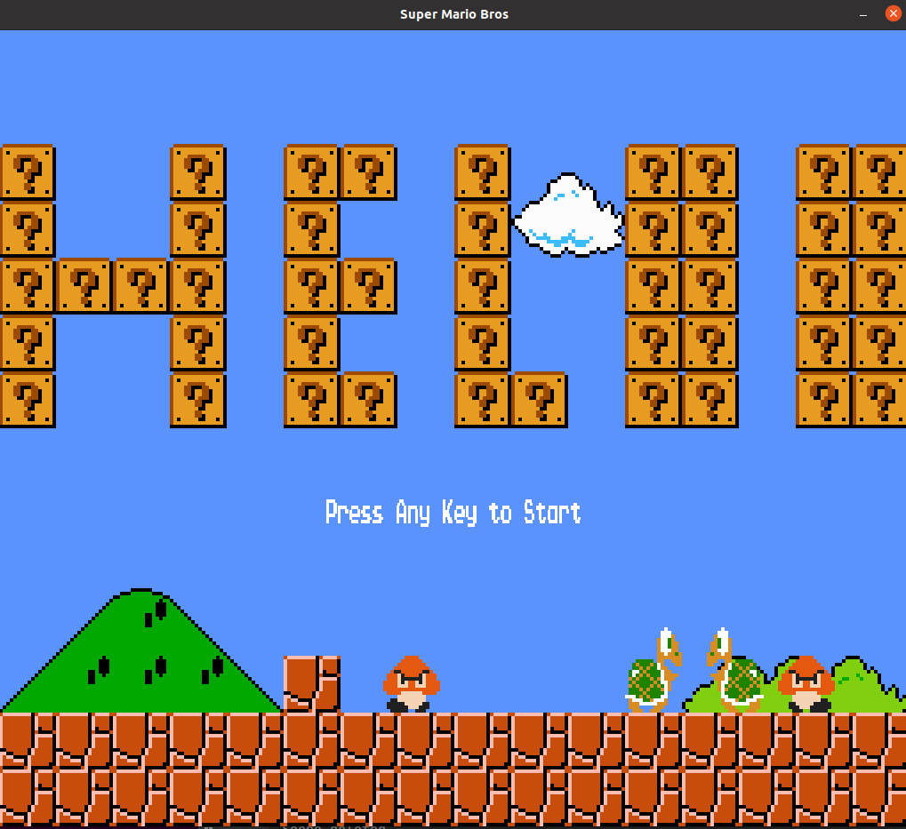
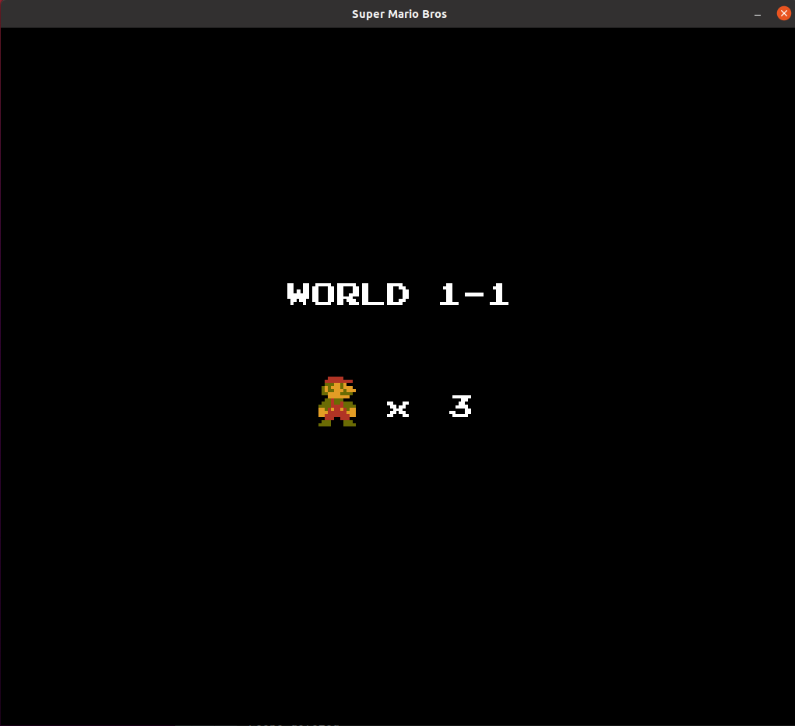
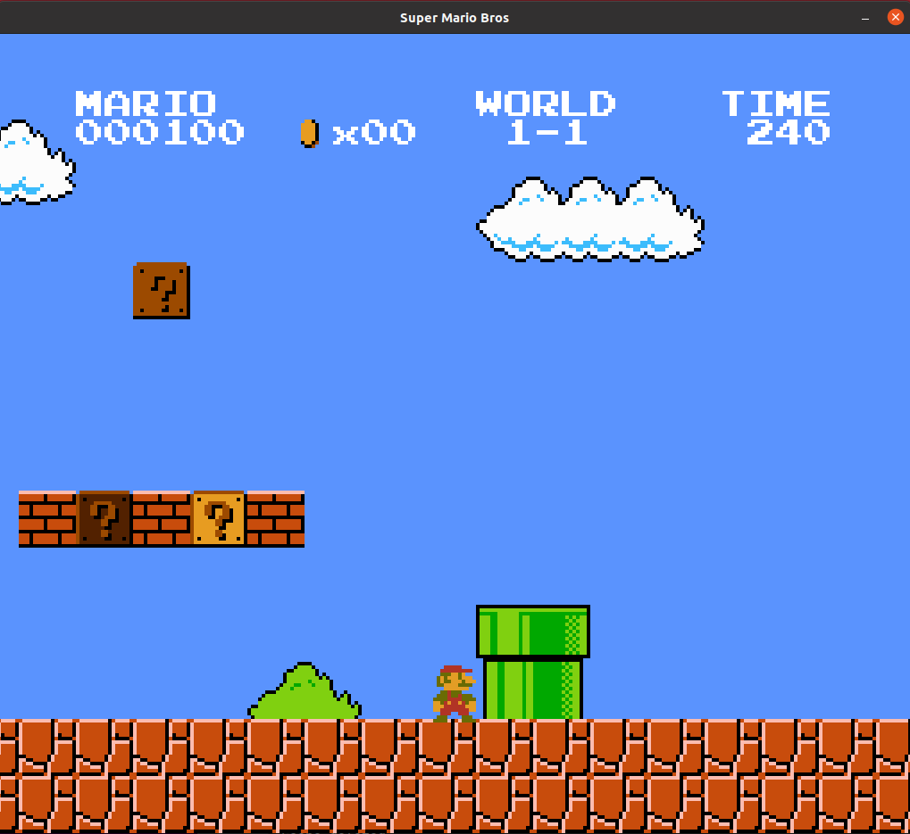
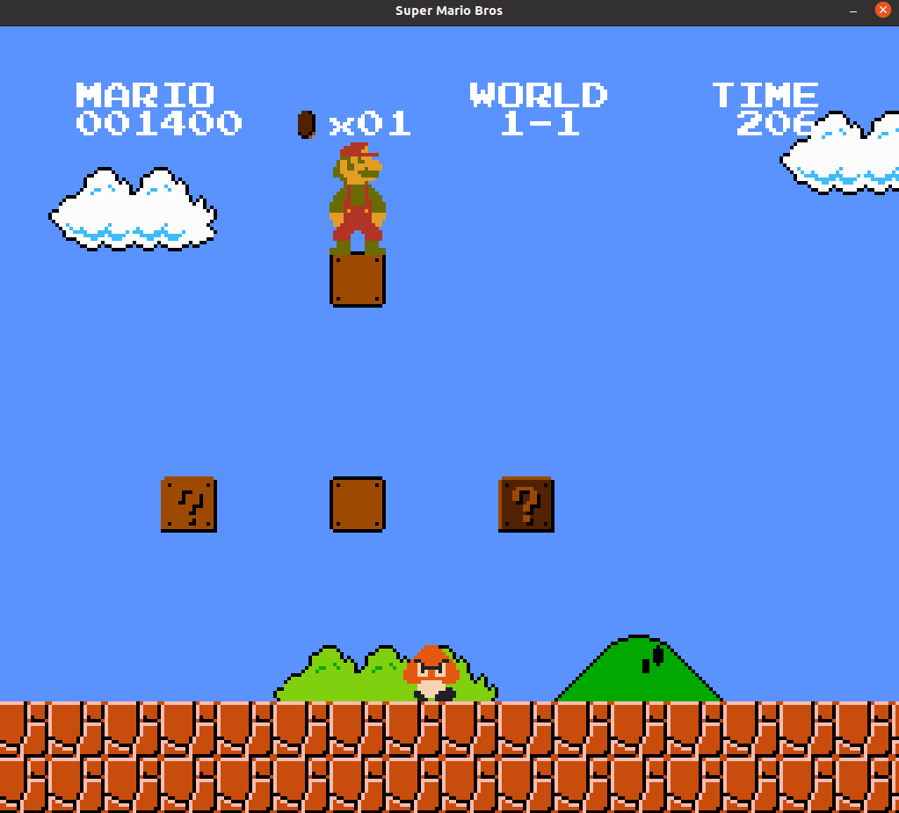

# Super Mario Clone

Super Mario Clone using C++ with SDL2.0.

Used ECS architecture: https://github.com/redxdev/ECS







## Project Rubric Points

#### Loops, Functions, I/O
- The project reads data from a file and process the data, or the program writes data to a file.
    - [x] The project [reads data from an external file] or writes data to a file as part of the necessary operation of the program.
      - In [MapSystem.h](include/MapSystem.h) line 26 on, external Map files are loaded into the game.
 
- The project accepts user input and processes the input.
    - [x] The project accepts input from a user as part of the necessary operation of the program.
      - This can be seen in the `PlayerSystem::handleEvent(SDL_Event& event)` function in [PlayerSystem.cpp](src/PlayerSystem.cpp)

- The project demonstrates an understanding of C++ functions and control structures.
    - [x] A variety of control structures are used in the project.
      - Example loop in [ScoreSystem.cpp](src/ScoreSystem.cpp) lines 76.

#### Object Oriented Programming

- The project uses Object Oriented Programming techniques.
    - [x] The project code is organized into classes with class attributes to hold the data, and class methods to perform tasks.
      - An example of this is in [SoundSystem.h](include/SoundSystem.h) file which is a class representing the Sound System for the game.

- Classes use appropriate access specifiers for class members.
    - [x] All class data members are explicitly specified as public, protected, or private.

- Derived class functions override virtual base class functions.
    - [x] One member function in an inherited class overrides a virtual base class member function.
      - An example of this is in [EnemySystem.h](include/EnemySystem.h) line 12.   

- Templates generalize functions in the project.
    - [x] One function is declared with a template that allows it to accept a generic parameter.
      - An example of this is in [ECS.h](include/ECS.h) line 127.

#### Memory Management

- The project uses move semantics to move data, instead of copying it, where possible.
    - [x] An example of this is in [ECS.h](include/ECS.h) line 30.

- The project uses smart pointers instead of raw pointers where possible.
    - [x] The project uses at least one smart pointer: unique_ptr, shared_ptr, or weak_ptr. The project does not use raw pointers.
      -   An example of this is in [SoundSystem.h](include/SoundSystem.h) line 25.
      -   An example of this is in [ECS.h](include/ECS.h) line 88.
    
    
## Dependencies

```
 cmake sdl2 sdl2_image sdl2_ttf sdl2_mixer bz2
```


```

sudo apt install libsdl2-dev libsdl2-2.0-0 -y


sudo apt install libjpeg-dev libwebp-dev libtiff5-dev libsdl2-image-dev libsdl2-image-2.0-0 -y


sudo apt install libmikmod-dev libfishsound1-dev libsmpeg-dev liboggz2-dev libflac-dev libfluidsynth-dev libsdl2-mixer-dev libsdl2-mixer-2.0-0 -y


sudo apt-get install libbz2-dev
```

## Build Instructions
1. Clone this repo.
2. Make a build directory in the top level directory: `mkdir build && cd build`.
3. Compile: `cmake .. && make`.
4. run game `./mario` inside `bin` directory.
 


## Game Controls

- Move:  `Up - Down - Left - Right` 
- Jump: `Space`
- Run `LCtrl` 
